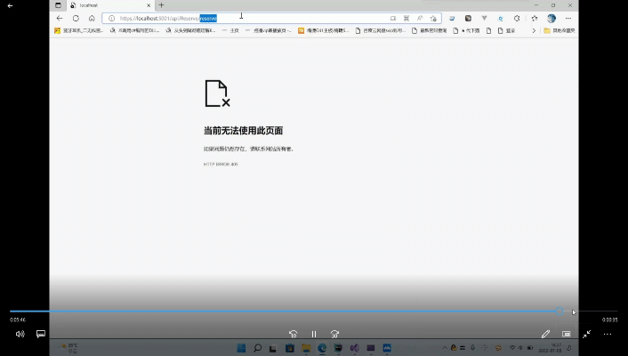
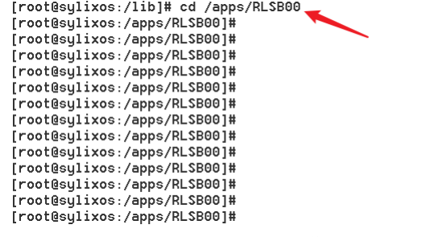

# Science-Association-Face-Recognition-Access-Control-System
This system takes the access control system of colleges and universities as the target object, aiming at some of its deficiencies that still exist: students forget to bring the campus card which leads to the inability to enter the study area, and the poor effect of daily punching card, taking the excellent domestic operating system Sylixos as the platform, and utilizing the face detection and face recognition technology of artificial intelligence, we are committed to developing this system to improve the efficiency of the utilization of the library of the contemporary colleges and universities and to facilitate the teachers and students of colleges and universities to perform the daily punching card.

## [Features-Face Authentication]
**Students swipe their faces to enter the office area
**Support for live body detection
**Supports partial facial occlusion detection
**Support low quality image detection
**Output Recognition Confidence
**High accuracy

## [information processing]
**Counting of students coming in and out
**Entering student information
**Setting up administrators
**Administrator notification

## [Access Control and Time & Attendance]
**Make a reservation for a special room
**View Attendance Information
**Counting absentees
**Controlling the flow of people through intelligent data processing

## [Dedicated server]
**MVC architecture 
**Interconnect with device side via HTTP
**RESTful interface communication
**Responsive design can be adapted to mobile or computer web pages

## Usage

####  Basic Environment Configuration

||| 
|--|--|
|operating system|SylixOS| 
|camera|Local camera or Logitech usb2.0|
|database|SQLite3| 
|VM Memory|1GB 以上|
|toolchain|x86-sylixos-toolchain|
|CPU|Pentium|
|FPU|hard-float|

### Setup

Step 1: Upload the dynamic libraries needed for the project to the sylixos system under lib files, which includes all .so files for the x86 version of opencv and libncnn.so files.

Step 2: Upload the executable folder "RLSB00" to the apps folder on the sylixos system.

Step 3: Execute cd /apps/RLSB00 in the command window to get inside the executable folder.

Step 4: Execute in that path . /RLSB00 -qws and the project is ready to be deployed to SylixOS!

Step 5: The result of running the project is shown in the figure.

